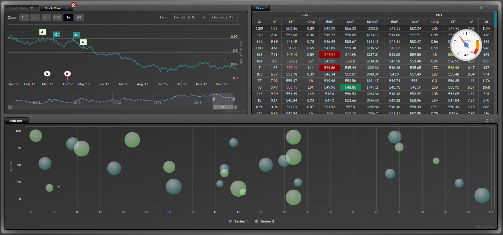

# NavLayout (beta) #  
[![alt text][1.1]][1]
[![alt text][2.1]][2]
[![alt text][3.1]][3]
[![alt text][4.1]][4]
[![alt text][5.1]][5]

[1.1]: http://i.imgur.com/tXSoThF.png (twitter)
[2.1]: http://i.imgur.com/P3YfQoD.png (facebook)
[3.1]: http://i.imgur.com/YckIOms.png (tumblr)
[4.1]: http://i.imgur.com/1AGmwO3.png (dribbble)
[5.1]: http://i.imgur.com/0o48UoR.png (github)

[1]: http://www.twitter.com/NavLayout
[2]: http://www.facebook.com/NavLayout
[3]: http://navlayout.tumblr.com
[4]: http://dribbble.com/NavLayout
[5]: http://www.github.com/navrosh/NavLayout

### [NavLayout](http://www.navlayout.com) is a pure javascript based powerful tabbed and dockable window framework which enables you to go beyond fixed layouts, designed for low footprint, no dependency, high performance & flexibility. ###

[Live Demo & API](http://www.navlayout.com)
  

### Some Possible Use Cases ###

 type  | detail 
--- | --- 
 | ***Websites / eCommerce*** : Why not changing conventional design layouts like search boxes always on top, fixed main menus / header / footer ... in my views everything should be responsive, floatable, dockable as per user choice.. Don't you think so ?  
 | ***Admin Dashboard*** : Admin dashboards are complex so why not giving user some gui flexibility to arrange his layout like menu, widgets... 
 | ***eMail Panels*** : Why not desktop like eMail applications for web ?
 | ***Financial Applications*** : It could help you to design a flexible portfolio, orderbook & order management system.
 | ***Anywhere where you want user the flexibility to design their own layout..***

 

### Some Key Points : ###

* Extremely responsive design

* convert your web design to work like apps

* Easily create your own themes

* Easily save and restore your layout as per your choice like cookie , local storage or a remote server

* Dynamically add, delete tabs / change layout any time

* Compatible with all major browsers(including IE7) and touch devices 

* Various Events to control the layout

* If you want to roll your own framework use NavLayout without any dependency problem 

* No DOM manipulation on Tabs after its creation to till its existence, rather than navlayout uses its memory based parent & child linkage paradigm

* logic could be easily ported into other languages like c++ , c#, java , etc.. targeting different platform.

### Issues ###

NavLayout uses GitHub's issue tracker for enhancements and bugs. But please do check the [GoogleGroup](https://groups.google.com/forum/#!forum/navlayout) before posting an issue. Also if the support need is urgent you can mail me at nav.ros@gmail.com

### Requirements ###

No external dependencies.

